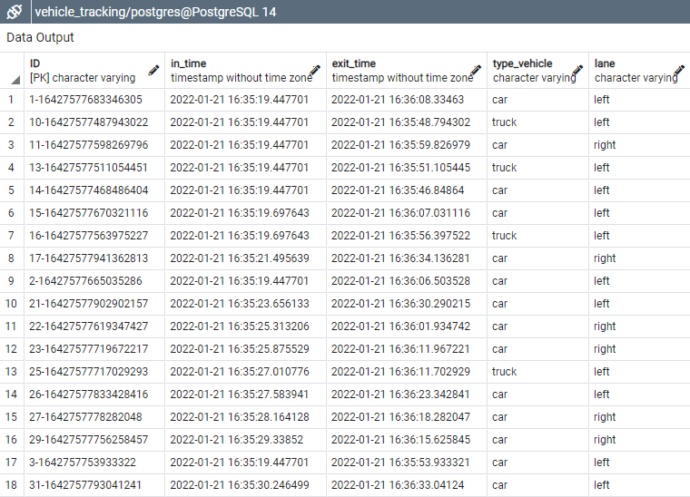
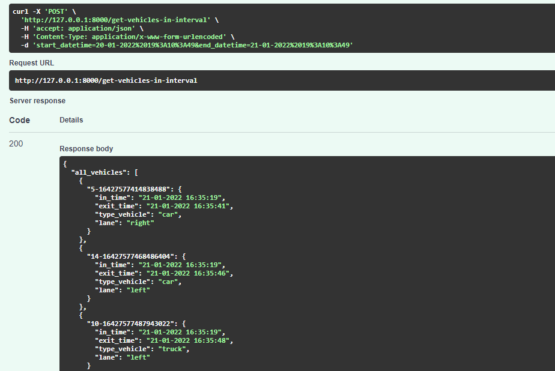

# Vehicle tracking with Yolov5 + Deep Sort with PyTorch

<p>

</p>

Full result video [HERE](https://youtu.be/TCc3Agqb8Tg)

The detections are generated by [YOLOv5](https://github.com/ultralytics/yolov5) are passed to  [Deep Sort algorithm](https://github.com/ZQPei/deep_sort_pytorch) which tracks the objects.

## Before running the tracker

Python 3.7.12 

```
pip install -r requirements.txt
```

    
## Config

`settings/`
<br></br>
`config.yml`  `deepsort.yml`  `db_config.yml`

## Running tracker

```
cd application\main
python app_track.py
```

## Saving result
Results can be save to databse: `upload_db` in file `config.yml`
<p>

</p>

## FastAPI

```
cd application\main
uvicorn app_API:app --host 0.0.0.0 --port 8000 --reload

```
<p>

</p>


