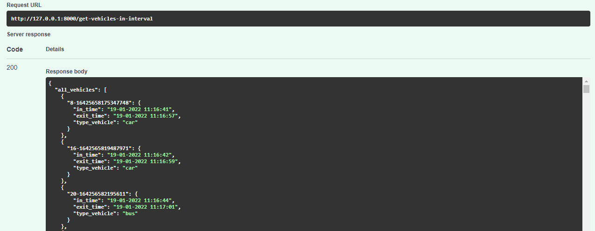

# Vehicle tracking with Yolov5 + Deep Sort with PyTorch

<p>

</p>


## Before running the tracker

Python 3.7.12 
<br></br>
```pip install -r requirements.txt```

    
## Config

`src/settings`
<br></br>
`config.yml`, `deepsort.yml`, `db_config.yml`

## Running

```
cd application\main
python app_track.py
```

## FastAPI
<p>

</p>

```
cd application\main
uvicorn app_API:app --host 0.0.0.0 --port 8000 --reload

```
